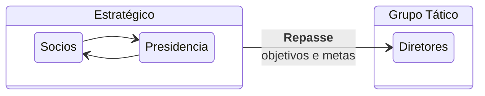
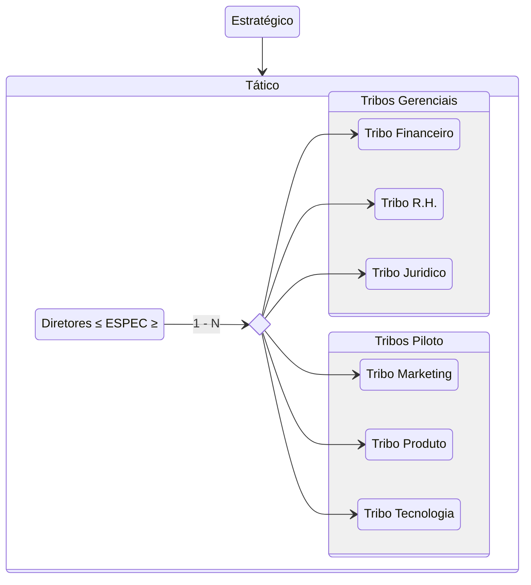
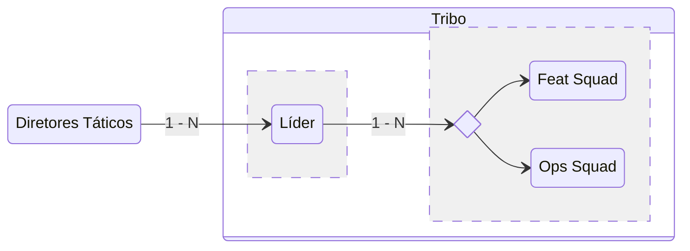

Este documento apresenta o organograma geral da empresa e suas subdivisões. A estrutura é projetada para definir as
camadas, visões, setores de hierarquia e suas respectivas funções dentro da organização, além de suas diretivas e
objetivos.

## Estruturas Organizacionais

1. **Camada Estratégica**

   Na organização, a Camada Estratégica é a mais alta em termos de responsabilidade e autoridade. As decisões tomadas
   nesta camada têm impacto direto e duradouro sobre o produto e o futuro da empresa. Esta camada é composta por sócios,
   presidência e outros cargos executivos, que trabalham em conjunto para definir as diretrizes da empresa.

2. **Camada Tática**

   A Camada Tática é responsável pela definição das métricas e indicadores-chave de desempenho (KPIs), bem como pelo
   estabelecimento de planos e estratégias para atingir os objetivos estabelecidos pela Camada Estratégica. Os diretores
   são encarregados de garantir que essas metas sejam atingidas pelas respectivas tribos.

3. **Camada Operacional (Tribo)**

   A Camada Operacional é composta por Squads, que são pequenos grupos autônomos focados em projetos ou funcionalidades
   específicas. A liderança das tribos assegura que os objetivos táticos sejam executados de acordo com os prazos e a
   qualidade esperada. Esses times são responsáveis pela entrega direta de valor ao produto.

> Todas as camadas tem ordem de prioridade para designar tarefas, metas ou objetivos que vão de `N0` (maior prioridade)
> até `N8` (menos prioritária).
>
> Esta regra aplica-se apenas a diretivas relacionadas ao cumprimento de metas ou impactos diretos no desenvolvimento do
> produto.

---

### Camada Estratégica

Na organização, a Camada Estratégica é a mais alta em termos de responsabilidade e autoridade. As decisões tomadas nesta
camada têm impacto direto e duradouro sobre o produto e o futuro da empresa. Esta camada é composta por sócios,
presidência e outros cargos executivos, que trabalham em conjunto para definir as diretrizes da empresa.

A camada Estratégica, com prioridade de N0-N2, é a camada responsável pelas decisões que têm impacto direto no
desenvolvimento do produto e no futuro da organização. As decisões são alinhadas com a visão, os valores e os objetivos
principais da empresa, sendo executadas pelas camadas mais altas da hierarquia.

Essa camada é composta por:

- **Sócios:** Responsáveis pela definição da missão e visão organizacional e principais decisões de longo prazo.
- **Presidência:** Responsável pela gestão executiva, supervisão da implementação de estratégias e alinhamento com os sócios.

---

### Camada Tática

A Visão Tática é responsável por definir métricas, organizar o fluxo de trabalho e implementar os objetivos
estratégicos. Com uma prioridade intermediária (N3-N5), a camada Tática tem como principal função transformar as metas
estratégicas em planos de ação práticos e mensuráveis.

Esta camada é composta pelos Diretores e suas respectivas Tribos, organizadas por áreas funcionais:

- **Tribo Financeira:** Responsável pela gestão financeira da empresa, garantindo a sustentabilidade e o uso eficiente dos
  recursos.
- **Tribo de RH:** Cuida das necessidades relacionadas à gestão de pessoas, desenvolvimento de talentos e cultura
  organizacional.
- **Tribo Jurídica:** Atua em conformidade com a legislação e garante que a empresa siga as normativas legais.
- **Tribo de Marketing:** Responsável pelas estratégias de comunicação e promoção da marca no mercado.
- **Tribo de Produto:** Focada no desenvolvimento e na evolução dos produtos da empresa.
- **Tribo de Tecnologia (TI):** Suporte técnico e desenvolvimento de soluções tecnológicas.

---

### Camada Tribo

A Visão Tribo representa a camada operacional, com foco na execução das atividades diárias. Essa camada se divide entre
Squads de Feat (responsáveis por funcionalidades específicas) e Squads de Operações (responsáveis pelo suporte
contínuo).

Cada tribo é liderada por um Líder de Tribo, que repassa as metas e os objetivos estabelecidos na visão Tática. A Visão
Tribo é classificada entre `N6-N8`, sendo voltada para a execução direta das atividades e demandas da empresa.

